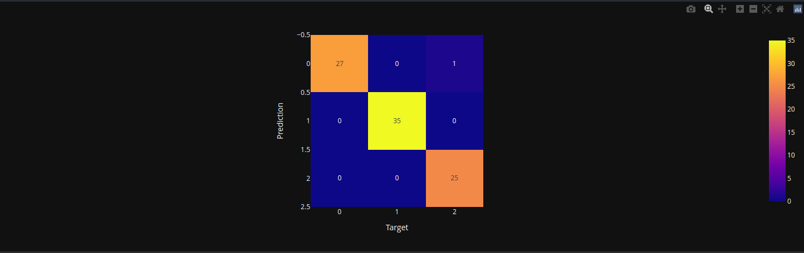

# Technologies and big data analysis tools
These are the practices from some AI-related course from my university. It was taught by 
our department of applied mathematics.

_# noinspection MachineTranslation_

_# noinspection Math_

---

# TODO: add content reference
# TODO: add datasets and their sources

---

## Practice 1 - Getting started with Python language

### Task 1
Install Python - _Seriously!_

### Task 2

Write a program that calculates the area of a figure,
the parameters of which are supplied to the input. Figures that are submitted for input:
triangle, rectangle, circle. The result of the work is a dictionary, where
the key is the name of the figure, and the value is the area.

P1T2

__Output__
```
t2 {'triangle': 1.0, 'rectangle': 12.0, 'circle':
78.53981633974483}
```

### Task 3

Write a program that takes two numbers as input and
the operation that needs to be applied to them. Must be implemented
the following operations: +, -, /, //, abs – modulus, pow or ** – exponentiation.

P1T3

__Output__
```
t3 3.0 2.0 1.0
```

### Task 4

Write a program that reads numbers from the console (by
one per line) until the sum of the entered numbers is equal to 0 and
after that it displays the sum of the squares of all read numbers.

P1T4

__Output__
```
t4:
1
2
-3
t4 14
```

### Task 5

Write a program that prints the sequence
numbers of length N, where each number is repeated as many times as it is equal to.
A non-negative integer N is passed to the program input. For example, if
N = 7, then the program should print 1 2 2 3 3 3 4. Printing list elements
separated by a space – print(*list).

P1T5

__Output__
```
t5 [1, 2, 2, 3, 3, 3, 4]
```

### Task 6

Given two lists: A = [1, 2, 3, 4, 2, 1, 3, 4, 5, 6, 5, 4, 3, 2] B =
['a', 'b', 'c', 'c', 'c', 'b', 'a', 'c', 'a', 'a', 'b', 'c', ' b', 'a']. Create a dictionary in
in which the keys are the contents of list B, and the values for the dictionary keys are
is the sum of all elements of list A according to the letter contained in
the same position in list B. Example program result: {‘a’ : 10, ‘b’ : 15, ‘c’
: 6}.

P1T6

__Output__
```
t6 {'a': 17, 'b': 11, 'c': 17}
```

### Task 7-12

Tasks seven to twelve were combined into
due to their small size. 7. Download and Upload Home Value Data
in California using the sklearn library. 8. Use the info() method. 9.
Find out if there are missing values using isna().sum(). 10. Withdraw
records where the average age of houses in the area is more than 50 years and the population is more than
2500 people using the loc() method. 11. Find out the maximum and minimum
median house price values. 12. Using the apply() method, output to
screen the name of the characteristic and its average value.

P1T7_12

__Output__
```
t7:
        MedInc  HouseAge  AveRooms  ...  AveOccup  Latitude  Longitude
0      8.3252      41.0  6.984127  ...  2.555556     37.88    -122.23
1      8.3014      21.0  6.238137  ...  2.109842     37.86    -122.22
2      7.2574      52.0  8.288136  ...  2.802260     37.85    -122.24
3      5.6431      52.0  5.817352  ...  2.547945     37.85    -122.25
4      3.8462      52.0  6.281853  ...  2.181467     37.85    -122.25
...       ...       ...       ...  ...       ...       ...        ...
20635  1.5603      25.0  5.045455  ...  2.560606     39.48    -121.09
20636  2.5568      18.0  6.114035  ...  3.122807     39.49    -121.21
20637  1.7000      17.0  5.205543  ...  2.325635     39.43    -121.22
20638  1.8672      18.0  5.329513  ...  2.123209     39.43    -121.32
20639  2.3886      16.0  5.254717  ...  2.616981     39.37    -121.24

[20640 rows x 8 columns]

t8:
<class 'pandas.core.frame.DataFrame'>
RangeIndex: 20640 entries, 0 to 20639
Data columns (total 8 columns):
 #   Column      Non-Null Count  Dtype
---  ------      --------------  -----
 0   MedInc      20640 non-null  float64
 1   HouseAge    20640 non-null  float64
 2   AveRooms    20640 non-null  float64
 3   AveBedrms   20640 non-null  float64
 4   Population  20640 non-null  float64
 5   AveOccup    20640 non-null  float64
 6   Latitude    20640 non-null  float64
 7   Longitude   20640 non-null  float64
dtypes: float64(8)
memory usage: 1.3 MB

t9:
MedInc        0
HouseAge      0
AveRooms      0
AveBedrms     0
Population    0
AveOccup      0
Latitude      0
Longitude     0
dtype: int64

t10:
       MedInc  HouseAge  AveRooms  ...    AveOccup  Latitude  Longitude
460    1.4012      52.0  3.105714  ...    9.534286     37.87    -122.26
4131   3.5349      52.0  4.646119  ...    5.910959     34.13    -118.20
4440   2.6806      52.0  4.806283  ...    4.007853     34.08    -118.21
5986   1.8750      52.0  4.500000  ...   21.333333     34.10    -117.71
7369   3.1901      52.0  4.730942  ...    4.182735     33.97    -118.21
8227   2.3305      52.0  3.488860  ...    3.955439     33.78    -118.20
13034  6.1359      52.0  8.275862  ...  230.172414     38.69    -121.15
15634  1.8295      52.0  2.628169  ...    4.164789     37.80    -122.41
15652  0.9000      52.0  2.237474  ...    2.237474     37.80    -122.41
15657  2.5166      52.0  2.839075  ...    1.621520     37.79    -122.41
15659  1.7240      52.0  2.278566  ...    1.780142     37.79    -122.41
15795  2.5755      52.0  3.402576  ...    2.108696     37.77    -122.42
15868  2.8135      52.0  4.584329  ...    3.966799     37.76    -122.41

[13 rows x 8 columns]

t11:
15.0001 0.4999

t12:
MedInc           3.870671
HouseAge        28.639486
AveRooms         5.429000
AveBedrms        1.096675
Population    1425.476744
AveOccup         3.070655
Latitude        35.631861
Longitude     -119.569704
dtype: float64
```

---

## Practice 2 - Familiarize yourself with various data visualization libraries

### Task 1

Find and download multidimensional data (with a large number of features - columns) 
using the pandas library. Describe the data found in the report.

### Task 2

Display information about the data using the .info(), .head() methods.
Check data for empty values. If present, remove row data or interpolate missing
values. If necessary, additionally pre-process the data for further work with it.

t1-t2

__Output__
```
t2:
<class 'pandas.core.frame.DataFrame'>
RangeIndex: 197 entries, 0 to 196
Data columns (total 9 columns):
 #   Column             Non-Null Count  Dtype
---  ------             --------------  -----
 0   income             195 non-null    float64
 1   life_exp           195 non-null    float64
 2   population         195 non-null    float64
 3   year               197 non-null    int64
 4   country            197 non-null    object
 5   four_regions       193 non-null    object
 6   six_regions        193 non-null    object
 7   eight_regions      193 non-null    object
 8   world_bank_region  193 non-null    object
dtypes: float64(3), int64(1), object(5)
memory usage: 14.0+ KB
t2:
     income  life_exp  ...       eight_regions           world_bank_region
0   1910.0      61.0  ...           asia_west                  South Asia
1  11100.0      78.1  ...         europe_east       Europe & Central Asia
2  11100.0      74.7  ...        africa_north  Middle East & North Africa
3  46900.0      81.9  ...         europe_west       Europe & Central Asia
4   7680.0      60.8  ...  africa_sub_saharan          Sub-Saharan Africa

[5 rows x 9 columns]
```

### Task 3

Plot a bar chart (.bar) using the graph_objs module from the Plotly library with the following parameters:
1. On the X-axis indicate the date or name, on the Y-axis indicate the quantitative indicator.
2. Make the column take on a color depending on the value of the indicator (marker=dict(color=attribute, coloraxis="coloraxis")).
3. Make sure that the borders of each column are highlighted with a black line with a thickness of 2.
4. Display the chart title, centered at the top, with text size 20.
5. Add labels for the X and Y axes with a text size of 16. For the x-axis, rotate the labels so that they are read at an angle of 315.
6. Make the text size of the axis labels equal to 14.
7. Place the graph across the entire width of the work area and set the height to 700 pixels.
8. Add a grid to the graph, make its color 'ivory' and thickness equal to 2. (You can do this when setting the axes using gridwidth=2, gridcolor='ivory').
9. Remove extra padding along the edges.

t3

__Output__


### Task 4

Create a pie chart (go.Pie) using the data and design style from the previous graph. 
Make sure that the boundaries of each share are highlighted with a black line with a 
thickness of 2 and the categories of the pie chart are readable (for example, combine 
some objects).

t4

__Output__


### Task 5

Construct linear graphs, take one of the parameters and determine the relationship 
between several other (from 2 to 5) indicators using the matplotlib library. Draw a 
conclusion. Make a graph with lines and markers, line color 'crimson', point color 
'white', point border color 'black', point border thickness 2. Add a grid to the 
graph, make its color 'mistyrose' and width equal to 2. (You can do this when 
setting the axes using linewidth=2, color='mistyrose').

t5

__Output__


__Conclusion__\
The first graph shows that the higher the income, the longer the life expectancy.
The second graph shows that the majority of income is concentrated in the vast 
minority of people, and also that most people have incomes that do not exceed $20,000.

### Task 6

Visualize multidimensional data using t-SNE. It is necessary to use the MNIST or 
fashion MNIST data set (you can also use other ready-made data sets where you can 
observe the division of objects into clusters). Consider the visualization results 
for different perplexity values.

t6

__Output__
```
t6:    label  1x1  1x2  1x3  1x4  1x5  ...  28x23  28x24  28x25  28x26  28x27  28x28
0      5    0    0    0    0    0  ...      0      0      0      0      0      0
1      0    0    0    0    0    0  ...      0      0      0      0      0      0
2      4    0    0    0    0    0  ...      0      0      0      0      0      0
3      1    0    0    0    0    0  ...      0      0      0      0      0      0
4      9    0    0    0    0    0  ...      0      0      0      0      0      0

[5 rows x 785 columns]
t6: Elapsed time: 1.5147051811218262 seconds
```


__Conclusion__\
From the resulting graphs it follows that the higher the perplexity value, the larger the 
clusters become. Perplexity (a variable parameter) describes the expected density around 
each point. Low values focus the algorithm on fewer neighbors, high values reduce the 
number of more densely packed groups.

### Task 7

Visualize multidimensional data using UMAP with different n_neighbors and min_dist 
parameters. Calculate the running time of the algorithm using the time library and 
compare it with the running time of t-SNE.

t7

__Output__
```
t7: Elapsed time: 1.9380676746368408 seconds
```


__Conclusion__\
Based on the obtained graphs, we can draw the following conclusion: Small values of 
the n_neighbors parameter mean that the algorithm is limited to a small neighborhood 
around each point - it tries to capture the local structure of the data. Large ones 
retain the global structure, but lose details. The min_dist parameter determines the 
minimum distance at which points can be located in the new space. Low values define 
the division of data into clusters, while high values define the structure of the data 
as a whole. Despite the fact that theoretically the UMAP method should be faster than 
the TSNE method, practical measurements have shown the opposite, although the difference 
is less than a second. The likely reason is that only the first 1000 data items are used, 
so both methods are fast, but if you increase the number of data items, the UMAP method 
is faster.

---

## Practice 3 - Familiarize yourself with various methods of statistical research

### Task 1

Load data from file

### Task 2

Use the describe() method to view statistics on the data. Draw conclusions.

t1-t2

__Output__
```
t2:
   age     sex     bmi  children smoker     region      charges
0   19  female  27.900         0    yes  southwest  16884.92400
1   18    male  33.770         1     no  southeast   1725.55230
2   28    male  33.000         3     no  southeast   4449.46200
3   33    male  22.705         0     no  northwest  21984.47061
4   32    male  28.880         0     no  northwest   3866.85520

               age          bmi     children       charges
count  1338.000000  1338.000000  1338.000000   1338.000000
mean     39.207025    30.663397     1.094918  13270.422265
std      14.049960     6.098187     1.205493  12110.011237
min      18.000000    15.960000     0.000000   1121.873900
25%      27.000000    26.296250     0.000000   4740.287150
50%      39.000000    30.400000     1.000000   9382.033000
75%      51.000000    34.693750     2.000000  16639.912515
max      64.000000    53.130000     5.000000  63770.428010
--------------------------------------------------
```

__Conclusion__\
You can see a count of all the attributes of the dataset, and also that age in the dataset goes 
from 18 to 64, bmi (body mass index) from 15.9 to 53, children (number of children) from 0 to 5, 
charges (expenses) from 1121.9 up to 63770. Average value (mean) of each attribute: 39 for age, 
30.6 for bmi, 1 for children, 13270 for charges. Standard deviation is an estimate for a sample 
that allows you to evaluate how much the data changes relative to their average: 14 for age, 6 
for bmi, 1 for children, 12110 for charges. Each subsequent quarter increases (25%, 50%, 75%, 
100%), the charges attribute increases more strongly. The count attribute is the same everywhere.

### Task 3

Construct histograms for numerical indicators. Draw conclusions.

t3

__Output__


__Conclusion__\
The x-axis indicates the values of the variable, and the y-axis indicates how often the value of 
this variable occurs in a certain interval. The interval length was chosen to be 15. From left to 
right, top to bottom, you can see how often the value of the variable appears. Charges values close 
to zero appear more often. The most common age value is close to zero, while the rest are evenly 
distributed. The bmi values have a normal distribution. The most common value of children is zero; 
the larger the number, the less repeated it is.

### Task 4

Find measures of central tendency and measures of dispersion for body mass index (bmi) and charges 
(charges). Display results as text and in histograms (3 vertical lines). Add a legend to graphs. 
Draw conclusions.

t4

__Output__
```
t4:
Mean BMI = 30.663397
Mode BMI:  32.3
Median BMI = 30.400000

Mean Charges = 13270.422265
Mode Charges:  1639.5631
Median Charges = 9382.033000

Standard Deviation of charges:  12110.011236694001
Range of charges:  62648.554110000005
Quarter range of charges using numpy:  11879.80148
Quarter range of charges with scipy:  11879.80148

Standard Deviation of bmi:  6.098186911679014
Range of bmi:  37.17
Quarter range of bmi using numpy:  8.384999999999998
Quarter range of bmi with scipy:  8.384999999999998
--------------------------------------------------
```


__Conclusion__\
The bmi graph shows that the values in it have a normal distribution. According to the charges graph, 
from left to right the values are repeated less. You can also see from the bmi graph that mode and 
median are close to each other - the mean and central values are almost the same. The most common 
value is mode. In charges, the mode value is the most repeated (on the left), also in charges there 
is much more variability in values, the average differs from the central one. The measure of dispersion 
includes: Standard Deviation, Range, Quarter range (the difference between the 1st and 3rd quarters 
is the most common). The range y of the charges attribute is very large (max – min).

### Task 5

Construct a box-plot for numerical indicators. The names of the graphs must correspond to the names 
of the features. Draw conclusions.

t5

__Output__


__Conclusion__\
In bmi and charges, the points outside the “whiskers” (quarters 1 and 3 (second 50%)) are outliers (values 
that are very different from other values, they are very rare), the orange line inside the “box” (clusters 
of average values) – median, outliers outside the category are too large to characterize the category. The 
graph shows the distribution of information in a certain category. Categories: age, bmi, charges and children. 
There are outliers only in the bmi and charges attributes, and these outliers are strictly greater than the 
maximum; in the rest they are not present. In charges, half of the values are outliers.

### Task 6

Using the charges or imb attribute, check whether the central limit theorem holds. Use different sample 
lengths n. Number of samples = 300. Display the result in the form of histograms. Find the standard deviation 
and mean for the resulting distributions. Draw conclusions.

t6

__Output__
```
t6:
Mean of  n=1    12198.327287   Std of  n=1    10855.966798
Mean of  n=10    13357.920196   Std of  n=10    4062.840514
Mean of  n=50    13118.524016   Std of  n=50    1833.114858
Mean of  n=100    13378.232319   Std of  n=100    1197.308316
Mean of  n=150    13309.708941   Std of  n=150    800.090288
Mean of  n=200    13260.895946   Std of  n=200    735.038002

Standard Deviation:  12110.011236694001
Range:  62648.554110000005
Quarter range using numpy:  11879.80148
Quarter range with scipy:  11879.80148
--------------------------------------------------
```


__Conclusion__\
Dataset values pass the central limit theorem in general and for various sample lengths (except n = 1) in particular. 
The larger n, the closer to the ideal form of the normal distribution. The value n is the length of samples. All mean 
values are around 12 thousand. The larger the sample length, the smaller the standard deviation and the closer the 
graph is to a very accurate form of normal distribution.

### Task 7

Construct 95% and 99% confidence intervals for the mean expenditure and mean BMI.

t7

__Output__
```
t7:
90% confidence interval for Charges:  (12725.864762144516, 13814.979768137997)
95% confidence interval for Charges:  (12621.54197822916, 13919.302552053354)
90% confidence interval for BMI:  (30.389176352638128, 30.93761736933497)
95% confidence interval for BMI:  (30.336642971534822, 30.990150750438275)
--------------------------------------------------
```

### Task 8

Check the distribution of the following characteristics for normality: body mass index, expenses. Formulate the null 
and alternative hypotheses. For each characteristic, use the KS test and q-q plot. Draw conclusions based on the 
obtained p-values.

t8

__Output__
```
t8:
KstestResult(statistic=0.02613962682509635, pvalue=0.31453976932347394, statistic_location=28.975, statistic_sign=1)
KstestResult(statistic=0.18846204110424236, pvalue=4.39305730768502e-42, statistic_location=13470.86, statistic_sign=1)
--------------------------------------------------
```


__Conclusion__\
The task is to test the null and alternative hypotheses, null – there is no difference (or there are few significant 
differences), alternative – there are significant differences (visible differences). They are determined by the p-level 
value (pvalue) - if it is less than 0.05, then the null hypothesis is rejected and the alternative is accepted, if it 
is more, vice versa. Hypotheses are always about difference. Normality – comparison of the dependence of the original 
sample values with the values of an ideal normal distribution. If the values follow the line exactly, then they are 
normally distributed. If the deviations are higher than the straight line, then the values are higher than normal and 
vice versa. Conclusions from the graphs: the bmi graph shows a fairly normal distribution, but the charges graph is 
very different from the normal distribution. The x-axis shows the standard normal distribution, and the y-axis shows 
the distribution of the sample under study. Null hypothesis - we assume that there are no differences between the ideal 
normal distribution and the dependence of our initial values (charges, for example). Alternative hypothesis - we assume 
that significant differences exist between the sample values and the normal distribution. For the bmi characteristic, 
the null hypothesis was chosen and the alternative was rejected, and for the charges characteristic, vice versa. The 
essence of the KS test is to assess the significance of the differences between two samples, as in the previous test 
(q-q). Here too, hypotheses are selected based on the pvalue. For the bmi feature, the pvalue is higher than 0.05, 
which means we need to accept the null hypothesis, since the sample has a normal distribution. The charges attribute 
has a much smaller pvalue, which means the null hypothesis is rejected since the sample does not have a normal 
distribution.

### Task 9

Load data from file

t9

__Output__
```
t9:
          dateRep  day  month  year  cases  deaths countriesAndTerritories  \
0      14/12/2020   14     12  2020    746       6             Afghanistan
1      13/12/2020   13     12  2020    298       9             Afghanistan
2      12/12/2020   12     12  2020    113      11             Afghanistan
3      12/12/2020   12     12  2020    113      11             Afghanistan
4      11/12/2020   11     12  2020     63      10             Afghanistan
...           ...  ...    ...   ...    ...     ...                     ...
61899  25/03/2020   25      3  2020      0       0                Zimbabwe
61900  24/03/2020   24      3  2020      0       1                Zimbabwe
61901  23/03/2020   23      3  2020      0       0                Zimbabwe
61902  22/03/2020   22      3  2020      1       0                Zimbabwe
61903  21/03/2020   21      3  2020      1       0                Zimbabwe

      geoId countryterritoryCode  popData2019 continentExp  \
0        AF                  AFG   38041757.0         Asia
1        AF                  AFG   38041757.0         Asia
2        AF                  AFG   38041757.0         Asia
3        AF                  AFG   38041757.0         Asia
4        AF                  AFG   38041757.0         Asia
...     ...                  ...          ...          ...
61899    ZW                  ZWE   14645473.0       Africa
61900    ZW                  ZWE   14645473.0       Africa
61901    ZW                  ZWE   14645473.0       Africa
61902    ZW                  ZWE   14645473.0       Africa
61903    ZW                  ZWE   14645473.0       Africa

       Cumulative_number_for_14_days_of_COVID-19_cases_per_100000
0                                               9.013779
1                                               7.052776
2                                               6.868768
3                                               6.868768
4                                               7.134266
...                                                  ...
61899                                                NaN
61900                                                NaN
61901                                                NaN
61902                                                NaN
61903                                                NaN

[61904 rows x 12 columns]

<class 'pandas.core.frame.DataFrame'>
RangeIndex: 61904 entries, 0 to 61903
Data columns (total 12 columns):
 #   Column                                             Non-Null Count  Dtype
---  ------                                             --------------  -----
 0   dateRep                                            61904 non-null  object
 1   day                                                61904 non-null  int64
 2   month                                              61904 non-null  int64
 3   year                                               61904 non-null  int64
 4   cases                                              61904 non-null  int64
 5   deaths                                             61904 non-null  int64
 6   countriesAndTerritories                            61904 non-null  object
 7   geoId                                              61629 non-null  object
 8   countryterritoryCode                               61781 non-null  object
 9   popData2019                                        61781 non-null  float64
 10  continentExp                                       61904 non-null  object
 11  Cumulative_number_for_14_days_of_COVID-19_cases_per_100000
                                                        59025 non-null  float64
dtypes: float64(2), int64(5), object(5)
memory usage: 5.7+ MB
--------------------------------------------------
```

### Task 10

Check the data for missing values. Display the number of missing values as a percentage. Remove the two features that 
have the most missing values. For the remaining features, process gaps: for a categorical feature, use filling with 
the default value (for example, “other”), for a numeric feature, use filling with the median value. Show that there 
are no more gaps in the data.

t10

__Output__
```
t10:
 dateRep : 0.0%
 day : 0.0%
 month : 0.0%
 year : 0.0%
 cases : 0.0%
 deaths : 0.0%
 countriesAndTerritories : 0.0%
 geoId : 0.4%
 countryterritoryCode : 0.2%
 popData2019 : 0.2%
 continentExp : 0.0%
 Cumulative_number_for_14_days_of_COVID-19_cases_per_100000 : 4.7%

          dateRep  day  month  year  cases  deaths countriesAndTerritories  \
0      14/12/2020   14     12  2020    746       6             Afghanistan
1      13/12/2020   13     12  2020    298       9             Afghanistan
2      12/12/2020   12     12  2020    113      11             Afghanistan
3      12/12/2020   12     12  2020    113      11             Afghanistan
4      11/12/2020   11     12  2020     63      10             Afghanistan
...           ...  ...    ...   ...    ...     ...                     ...
61899  25/03/2020   25      3  2020      0       0                Zimbabwe
61900  24/03/2020   24      3  2020      0       1                Zimbabwe
61901  23/03/2020   23      3  2020      0       0                Zimbabwe
61902  22/03/2020   22      3  2020      1       0                Zimbabwe
61903  21/03/2020   21      3  2020      1       0                Zimbabwe

      countryterritoryCode  popData2019 continentExp
0                      AFG   38041757.0         Asia
1                      AFG   38041757.0         Asia
2                      AFG   38041757.0         Asia
3                      AFG   38041757.0         Asia
4                      AFG   38041757.0         Asia
...                    ...          ...          ...
61899                  ZWE   14645473.0       Africa
61900                  ZWE   14645473.0       Africa
61901                  ZWE   14645473.0       Africa
61902                  ZWE   14645473.0       Africa
61903                  ZWE   14645473.0       Africa

[61904 rows x 10 columns]

 dateRep : 0.0%
 day : 0.0%
 month : 0.0%
 year : 0.0%
 cases : 0.0%
 deaths : 0.0%
 countriesAndTerritories : 0.0%
 countryterritoryCode : 0.0%
 popData2019 : 0.0%
 continentExp : 0.0%
--------------------------------------------------
```

### Task 11

View statistics on data using describe(). Draw conclusions about which features contain outliers. See for which 
countries the number of deaths per day exceeded 3000 and how many such days there were.

t11

__Output__
```
t11:
                day         month          year          cases        deaths  \
count  61904.000000  61904.000000  61904.000000   61904.000000  61904.000000
mean      15.629232      7.067104   2019.998918    1155.079026     26.053987
std        8.841624      2.954816      0.032881    6779.010824    131.222948
min        1.000000      1.000000   2019.000000   -8261.000000  -1918.000000
25%        8.000000      5.000000   2020.000000       0.000000      0.000000
50%       15.000000      7.000000   2020.000000      15.000000      0.000000
75%       23.000000     10.000000   2020.000000     273.000000      4.000000
max       31.000000     12.000000   2020.000000  234633.000000   4928.000000

        popData2019
count  6.190400e+04
mean   4.091909e+07
std    1.529798e+08
min    8.150000e+02
25%    1.324820e+06
50%    7.169456e+06
75%    2.851583e+07
max    1.433784e+09

0        False
1        False
2        False
3        False
4        False
         ...
61899    False
61900    False
61901    False
61902    False
61903    False
Name: deaths, Length: 61904, dtype: bool

There are 11 days where deaths >= 3000

          dateRep  day  month  year   cases  deaths   countriesAndTerritories  \
2118   02/10/2020    2     10  2020   14001    3351                 Argentina
16908  07/09/2020    7      9  2020   -8261    3800                   Ecuador
37038  09/10/2020    9     10  2020    4936    3013                    Mexico
44888  14/08/2020   14      8  2020    9441    3935                      Peru
44909  24/07/2020   24      7  2020    4546    3887                      Peru
59007  12/12/2020   12     12  2020  234633    3343  United_States_of_America
59009  10/12/2020   10     12  2020  220025    3124  United_States_of_America
59016  03/12/2020    3     12  2020  203311    3190  United_States_of_America
59239  24/04/2020   24      4  2020   26543    3179  United_States_of_America
59245  18/04/2020   18      4  2020   30833    3770  United_States_of_America
59247  16/04/2020   16      4  2020   30148    4928  United_States_of_America

      countryterritoryCode  popData2019 continentExp
2118                   ARG   44780675.0      America
16908                  ECU   17373657.0      America
37038                  MEX  127575529.0      America
44888                  PER   32510462.0      America
44909                  PER   32510462.0      America
59007                  USA  329064917.0      America
59009                  USA  329064917.0      America
59016                  USA  329064917.0      America
59239                  USA  329064917.0      America
59245                  USA  329064917.0      America
59247                  USA  329064917.0      America
--------------------------------------------------
```


__Conclusion__\
Outliers are present in the cases and deaths characteristics because there the minima are negative (can be seen from 
describe()) – the values to the left of the significant minimum. It is also clear from the general graph that outliers 
are also present in the year and popData2019 features. The latter has more of them than the others. A total of 11 days 
were found when the number of deaths exceeded 3000. Countries in which these days were recorded: Argentina (Argentina), 
Ecuador (Ecuador), Mexico (Mexico), Peru (Peru), United_States_of_America (USA).

### Task 12

Find data duplication. Remove duplicates.

t12

__Output__
```
t12:
          dateRep  day  month  year  cases  deaths countriesAndTerritories  \
3      12/12/2020   12     12  2020    113      11             Afghanistan
218    12/05/2020   12      5  2020    285       2             Afghanistan
48010  29/05/2020   29      5  2020      0       0             Saint_Lucia
48073  28/03/2020   28      3  2020      0       0             Saint_Lucia

      countryterritoryCode  popData2019 continentExp
3                      AFG   38041757.0         Asia
218                    AFG   38041757.0         Asia
48010                  LCA     182795.0      America
48073                  LCA     182795.0      America

          dateRep  day  month  year  cases  deaths countriesAndTerritories  \
0      14/12/2020   14     12  2020    746       6             Afghanistan
1      13/12/2020   13     12  2020    298       9             Afghanistan
2      12/12/2020   12     12  2020    113      11             Afghanistan
4      11/12/2020   11     12  2020     63      10             Afghanistan
5      10/12/2020   10     12  2020    202      16             Afghanistan
...           ...  ...    ...   ...    ...     ...                     ...
61899  25/03/2020   25      3  2020      0       0                Zimbabwe
61900  24/03/2020   24      3  2020      0       1                Zimbabwe
61901  23/03/2020   23      3  2020      0       0                Zimbabwe
61902  22/03/2020   22      3  2020      1       0                Zimbabwe
61903  21/03/2020   21      3  2020      1       0                Zimbabwe

      countryterritoryCode  popData2019 continentExp
0                      AFG   38041757.0         Asia
1                      AFG   38041757.0         Asia
2                      AFG   38041757.0         Asia
4                      AFG   38041757.0         Asia
5                      AFG   38041757.0         Asia
...                    ...          ...          ...
61899                  ZWE   14645473.0       Africa
61900                  ZWE   14645473.0       Africa
61901                  ZWE   14645473.0       Africa
61902                  ZWE   14645473.0       Africa
61903                  ZWE   14645473.0       Africa

[61900 rows x 10 columns]

Empty DataFrame
Columns: [dateRep, day, month, year, cases, deaths, countriesAndTerritories, countryterritoryCode, popData2019, continentExp]
Index: []
--------------------------------------------------
```

### Task 13

Load data from the file “bmi.csv”. Take two samples from there. One sample is the body mass index of people from the 
northwest region, the second sample is the body mass index of people from the southwest region. Compare the means of 
these samples using Student's t-test. Preliminarily check samples for normality (Shopiro-Wilk test) and homogeneity of 
variance (Bartlett test).

t13

__Output__
```
t13:
      bmi     region
0  22.705  northwest
1  28.880  northwest
2  27.740  northwest
3  25.840  northwest
4  28.025  northwest

        bmi     region
0    22.705  northwest
1    28.880  northwest
2    27.740  northwest
3    25.840  northwest
4    28.025  northwest
..      ...        ...
320  26.315  northwest
321  31.065  northwest
322  25.935  northwest
323  30.970  northwest
324  29.070  northwest

[325 rows x 2 columns]

      bmi     region
325  27.9  southwest
326  34.4  southwest
327  24.6  southwest
328  40.3  southwest
329  35.3  southwest
..    ...        ...
645  20.6  southwest
646  38.6  southwest
647  33.4  southwest
648  44.7  southwest
649  25.8  southwest

[325 rows x 2 columns]

The variance of both data groups: 26.305165492071005 32.29731162130177

TtestResult(statistic=-3.2844171500398582, pvalue=0.001076958496307695, df=648.0)

(-3.2844171500398667, 0.0010769584963076643, 648.0)

ShapiroResult(statistic=0.9954646825790405, pvalue=0.4655335247516632)
 ShapiroResult(statistic=0.9949268698692322, pvalue=0.3629520535469055)

BartlettResult(statistic=3.4000745256459286, pvalue=0.06519347353581818)
--------------------------------------------------
```

__Conclusion__\
Null hypothesis - there will be no significant difference between the average bmi values of the northwest and southwest 
regions, alternative - there will be a difference. Since 0.001 (T test) is less than 0.005, the null theory must be 
rejected - there is a significant difference between the average bmi values of the two regions. Normality: in both 
tests the pvalue (Shapiro) is above 0.05, which means we need to accept the null hypothesis - bmi in both regions has 
a normal distribution. Homogeneity – testing the equality of depressions in two samples. Null hypothesis – the samples 
under consideration are obtained from general populations with the same depression. The alternative hypothesis is the 
opposite. Since 0.06 (Barlett) > 0.05 – we accept the null hypothesis – the depressions of the samples are the same – 
there are no significant differences between the bmi values of the regions.

### Task 14

The dice was rolled 600 times and the following results were obtained (see Listing 13). Use the Chi-square test to 
check whether the resulting distribution is uniform. Use the scipy.stats.chisquare() function.

t14

__Output__
```
t14:
   N  Observed  Expected
0  1        97       100
1  2        98       100
2  3       109       100
3  4        95       100
4  5        97       100
5  6       104       100

Power_divergenceResult(statistic=1.44, pvalue=0.9198882077437889)
--------------------------------------------------
```

__Conclusion__\
The null hypothesis is that there will be a uniform distribution in the number of drops. Since 0.92 > 0.05, we accept 
the null hypothesis – uniform distribution.

### Task 15

Use the Chi-square test to test whether the variables are dependent. Create a dataframe using the following code 
(see Listing 14). Use the scipy.stats.chi2_contingency() function. Does marital status affect employment?

t15

__Output__
```
t15:
                        Married  Civil marriage  Isn't in relationships
Full working day             89              80                      35
Part-time employment         17              22                      44
Temporary doesn't work       11              20                      35
On the household             43              35                       6
Retired                      22               6                       8

1.7291616900960234e-21
--------------------------------------------------
```

__Conclusion__\
The null hypothesis is that marital status does not affect employment, the alternative hypothesis does (there is a 
significant relationship). Since the pvalue is very small (< 0.05), we reject the null hypothesis and accept the 
alternative - there is a relationship (marital status affects employment).

---

## Practice 4 - Correlation, linear regression and analysis of variance
Gain skills in working with methods for calculating correlation and linear regression, conducting analysis of variance.

### Task 1

Determine two vectors representing the number of cars parked during 5 working days at the business center in the 
street parking lot and in the underground garage. 
1. Find and interpret the correlation between the variables “Street” and “Garage” (calculate the Pearson correlation).
2. Construct a scatter plot for the above variables.

t1

__Output__
```
t1:
[[ 1. -1.]
 [-1.  1.]]
-0.9999999999999998
--------------------------------------------------
```


__Conclusion__\
From the correlation matrix and the separately derived correlation coefficient, it is clear that there is a 
relationship - the correlation is almost -1, which means there is a strong negative correlation.

### Task 2

Find and download data. Derive, preprocess and describe the features.
1. Construct a correlation matrix for one target variable. Determine the most correlated variable and continue working with it in the next paragraph.
2. Implement regression manually, display slope, shift and MSE.
3. Visualize the regression on a graph.

t2

__Output__
```
t2:
    species     island  culmen_length_mm  culmen_depth_mm  flipper_length_mm  \
0    Adelie  Torgersen              39.1             18.7              181.0
1    Adelie  Torgersen              39.5             17.4              186.0
2    Adelie  Torgersen              40.3             18.0              195.0
3    Adelie  Torgersen               NaN              NaN                NaN
4    Adelie  Torgersen              36.7             19.3              193.0
..      ...        ...               ...              ...                ...
339  Gentoo     Biscoe               NaN              NaN                NaN
340  Gentoo     Biscoe              46.8             14.3              215.0
341  Gentoo     Biscoe              50.4             15.7              222.0
342  Gentoo     Biscoe              45.2             14.8              212.0
343  Gentoo     Biscoe              49.9             16.1              213.0

     body_mass_g     sex
0         3750.0    MALE
1         3800.0  FEMALE
2         3250.0  FEMALE
3            NaN     NaN
4         3450.0  FEMALE
..           ...     ...
339          NaN     NaN
340       4850.0  FEMALE
341       5750.0    MALE
342       5200.0  FEMALE
343       5400.0    MALE

[344 rows x 7 columns]

     species  island  culmen_length_mm  culmen_depth_mm  flipper_length_mm  \
0          0       0              39.1             18.7              181.0
1          0       0              39.5             17.4              186.0
2          0       0              40.3             18.0              195.0
3          0       0               NaN              NaN                NaN
4          0       0              36.7             19.3              193.0
..       ...     ...               ...              ...                ...
339        2       1               NaN              NaN                NaN
340        2       1              46.8             14.3              215.0
341        2       1              50.4             15.7              222.0
342        2       1              45.2             14.8              212.0
343        2       1              49.9             16.1              213.0

     body_mass_g  sex
0         3750.0    0
1         3800.0    1
2         3250.0    1
3            NaN   -1
4         3450.0    1
..           ...  ...
339          NaN   -1
340       4850.0    1
341       5750.0    0
342       5200.0    1
343       5400.0    0

[344 rows x 7 columns]

     species  island  culmen_length_mm  culmen_depth_mm  flipper_length_mm  \
0        0.0     0.0          0.254545         0.666667           0.152542
1        0.0     0.0          0.269091         0.511905           0.237288
2        0.0     0.0          0.298182         0.583333           0.389831
3        0.0     0.0          0.167273         0.738095           0.355932
4        0.0     0.0          0.261818         0.892857           0.305085
..       ...     ...               ...              ...                ...
337      1.0     0.5          0.549091         0.071429           0.711864
338      1.0     0.5          0.534545         0.142857           0.728814
339      1.0     0.5          0.665455         0.309524           0.847458
340      1.0     0.5          0.476364         0.202381           0.677966
341      1.0     0.5          0.647273         0.357143           0.694915

     body_mass_g       sex
0       0.291667  0.333333
1       0.305556  0.666667
2       0.152778  0.666667
3       0.208333  0.666667
4       0.263889  0.333333
..           ...       ...
337     0.618056  0.666667
338     0.597222  0.666667
339     0.847222  0.333333
340     0.694444  0.666667
341     0.750000  0.333333

[342 rows x 7 columns]

     species  island  culmen_length_mm  culmen_depth_mm  flipper_length_mm  \
0        0.0     0.0          0.254545         0.666667           0.152542
1        0.0     0.0          0.269091         0.511905           0.237288
2        0.0     0.0          0.298182         0.583333           0.389831
3        0.0     0.0          0.167273         0.738095           0.355932
4        0.0     0.0          0.261818         0.892857           0.305085
..       ...     ...               ...              ...                ...
337      1.0     0.5          0.549091         0.071429           0.711864
338      1.0     0.5          0.534545         0.142857           0.728814
339      1.0     0.5          0.665455         0.309524           0.847458
340      1.0     0.5          0.476364         0.202381           0.677966
341      1.0     0.5          0.647273         0.357143           0.694915

     body_mass_g       sex
0       0.291667  0.333333
1       0.305556  0.666667
2       0.152778  0.666667
3       0.208333  0.666667
4       0.263889  0.333333
..           ...       ...
337     0.618056  0.666667
338     0.597222  0.666667
339     0.847222  0.333333
340     0.694444  0.666667
341     0.750000  0.333333

[342 rows x 7 columns]

[[1.         0.75049112]
 [0.75049112 1.        ]]

0.7504911189081507

                   species  island  culmen_length_mm  culmen_depth_mm  \
species              1.000   0.005             0.731           -0.744
island               0.005   1.000             0.223            0.180
culmen_length_mm     0.731   0.223             1.000           -0.235
culmen_depth_mm     -0.744   0.180            -0.235            1.000
flipper_length_mm    0.854  -0.145             0.656           -0.584
body_mass_g          0.750  -0.189             0.595           -0.472
sex                  0.012   0.047            -0.269           -0.323

                   flipper_length_mm  body_mass_g    sex
species                        0.854        0.750  0.012
island                        -0.145       -0.189  0.047
culmen_length_mm               0.656        0.595 -0.269
culmen_depth_mm               -0.584       -0.472 -0.323
flipper_length_mm              1.000        0.871 -0.197
body_mass_g                    0.871        1.000 -0.347
sex                           -0.197       -0.347  1.000
[0.93208977] 0.10126324431123246

0.013649956706809902

--------------------------------------------------
```


__Conclusion__
1. A pair of any 2 variables was selected, a correlation matrix was calculated from them and a coefficient of 
0.75049111189081507 was determined - rather, there is a positive correlation. Then, based on the calculated table, the 
pair of variables with the highest correlation was precisely determined - body_mass_g and flipper_length_mm with a 
coefficient of 0.871.
2. Regression was calculated (best fit line - a line that captures the majority of points, a line that shows how the 
data (points) are correlated). Next, a slope (model1.coef_) equal to 0.93208977 and an offset (model1.intercept_) 
equal to 0.10126324431123246 were found, the slope coefficient reports a slope of approximately 30 degrees from the 
origin. At the end, MSE was found - mean squared error (mean squared error - a metric that shows how accurate the 
forecasts are and what is the magnitude of the deviation from the actual values) equal to 0.013649956706809902, since 
the closer the value is to zero, the better the model, then at a given value ( 0.01) the constructed model is almost ideal.
3. A regression graph was constructed, from which a positive relationship can be seen - the more one, the more the other.

### Task 3

Load data: 'insurance.csv'. Output and preprocess. List unique regions.
1. Perform a one-way ANOVA test to test the effect of region on body mass index (BMI) using the first method through the Scipy library.
2. Perform a one-way ANOVA test to test the effect of region on body mass index (BMI) using the second method, using the anova_lm() function from the statsmodels library.
3. Using Student's t test, sort through all pairs. Define the Bonferroni correction. Draw conclusions.
4. Perform Tukey's post-hoc tests and plot the graph.
5. Run a two-way ANOVA test to test the effect of region and gender on body mass index (BMI) using the anova_lm() function from the statsmodels library.
6. Perform Tukey's post-hoc tests and plot the graph.

t3

__Output__
```
t3:
      age     sex     bmi  children smoker     region      charges
0      19  female  27.900         0    yes  southwest  16884.92400
1      18    male  33.770         1     no  southeast   1725.55230
2      28    male  33.000         3     no  southeast   4449.46200
3      33    male  22.705         0     no  northwest  21984.47061
4      32    male  28.880         0     no  northwest   3866.85520
...   ...     ...     ...       ...    ...        ...          ...
1333   50    male  30.970         3     no  northwest  10600.54830
1334   18  female  31.920         0     no  northeast   2205.98080
1335   18  female  36.850         0     no  southeast   1629.83350
1336   21  female  25.800         0     no  southwest   2007.94500
1337   61  female  29.070         0    yes  northwest  29141.36030

[1338 rows x 7 columns]

<class 'pandas.core.frame.DataFrame'>
RangeIndex: 1338 entries, 0 to 1337
Data columns (total 7 columns):
 #   Column    Non-Null Count  Dtype
---  ------    --------------  -----
 0   age       1338 non-null   int64
 1   sex       1338 non-null   object
 2   bmi       1338 non-null   float64
 3   children  1338 non-null   int64
 4   smoker    1338 non-null   object
 5   region    1338 non-null   object
 6   charges   1338 non-null   float64
dtypes: float64(2), int64(2), object(3)
memory usage: 73.3+ KB


 age : 0.0%
 sex : 0.0%
 bmi : 0.0%
 children : 0.0%
 smoker : 0.0%
 region : 0.0%
 charges : 0.0%


['southwest' 'southeast' 'northwest' 'northeast']

F_onewayResult(statistic=39.49505720170283, pvalue=1.881838913929143e-24)

                sum_sq      df          F        PR(>F)
region     4055.880631     3.0  39.495057  1.881839e-24
Residual  45664.319755  1334.0        NaN           NaN

northeast northwest
TtestResult(statistic=-0.060307727183293185, pvalue=0.951929170821864, df=647.0)
5.711575024931184
northeast southeast
TtestResult(statistic=-8.790905562598699, pvalue=1.186014937424813e-17, df=686.0)
7.116089624548878e-17
northeast southwest
TtestResult(statistic=-3.1169000930045923, pvalue=0.0019086161671573072, df=647.0)
0.011451697002943843
northwest southeast
TtestResult(statistic=-9.25649013552548, pvalue=2.643571405230106e-19, df=687.0)
1.5861428431380637e-18
northwest southwest
TtestResult(statistic=-3.2844171500398582, pvalue=0.001076958496307695, df=648.0)
0.006461750977846171
southeast southwest
TtestResult(statistic=5.908373821545118, pvalue=5.4374009639680636e-09, df=687.0)
3.2624405783808385e-08


30.66339686098655
30.4


   Multiple Comparison of Means - Tukey HSD, FWER=0.05
==========================================================
  group1    group2  meandiff p-adj   lower   upper  reject
----------------------------------------------------------
northeast northwest   0.0263 0.9999 -1.1552  1.2078  False
northeast southeast   4.1825    0.0   3.033   5.332   True
northeast southwest   1.4231 0.0107  0.2416  2.6046   True
northwest southeast   4.1562    0.0  3.0077  5.3047   True
northwest southwest   1.3968 0.0127  0.2162  2.5774   True
southeast southwest  -2.7594    0.0 -3.9079 -1.6108   True
----------------------------------------------------------

                df        sum_sq      mean_sq          F        PR(>F)
region         3.0   4055.880631  1351.960210  39.602259  1.636858e-24
sex            1.0     86.007035    86.007035   2.519359  1.126940e-01
region:sex     3.0    174.157808    58.052603   1.700504  1.650655e-01
Residual    1330.0  45404.154911    34.138462        NaN           NaN

         Multiple Comparison of Means - Tukey HSD, FWER=0.05
======================================================================
     group1          group2     meandiff p-adj   lower   upper  reject
----------------------------------------------------------------------
northeastfemale   northeastmale  -0.2998 0.9998 -2.2706  1.6711  False
northeastfemale northwestfemale  -0.0464    1.0 -2.0142  1.9215  False
northeastfemale   northwestmale  -0.2042    1.0 -2.1811  1.7728  False
northeastfemale southeastfemale   3.3469    0.0    1.41  5.2839   True
northeastfemale   southeastmale   4.6657    0.0  2.7634   6.568   True
northeastfemale southwestfemale   0.7362 0.9497 -1.2377    2.71  False
northeastfemale   southwestmale   1.8051 0.1007 -0.1657   3.776  False
  northeastmale northwestfemale   0.2534 0.9999 -1.7083  2.2152  False
  northeastmale   northwestmale   0.0956    1.0 -1.8752  2.0665  False
  northeastmale southeastfemale   3.6467    0.0  1.7159  5.5775   True
  northeastmale   southeastmale   4.9655    0.0  3.0695  6.8614   True
  northeastmale southwestfemale    1.036 0.7515 -0.9318  3.0037  False
  northeastmale   southwestmale   2.1049 0.0258  0.1402  4.0697   True
northwestfemale   northwestmale  -0.1578    1.0 -2.1257    1.81  False
northwestfemale southeastfemale   3.3933    0.0  1.4656   5.321   True
northwestfemale   southeastmale    4.712    0.0  2.8192  6.6049   True
northwestfemale southwestfemale   0.7825 0.9294 -1.1822  2.7473  False
northwestfemale   southwestmale   1.8515 0.0806 -0.1103  3.8132  False
  northwestmale southeastfemale   3.5511    0.0  1.6141  5.4881   True
  northwestmale   southeastmale   4.8698    0.0  2.9676  6.7721   True
  northwestmale southwestfemale   0.9403 0.8354 -1.0335  2.9142  False
  northwestmale   southwestmale   2.0093  0.042  0.0385  3.9801   True
southeastfemale   southeastmale   1.3187 0.3823  -0.542  3.1795  False
southeastfemale southwestfemale  -2.6108 0.0011 -4.5446 -0.6769   True
southeastfemale   southwestmale  -1.5418 0.2304 -3.4726   0.389  False
  southeastmale southwestfemale  -3.9295    0.0 -5.8286 -2.0304   True
  southeastmale   southwestmale  -2.8606 0.0001 -4.7565 -0.9646   True
southwestfemale   southwestmale    1.069 0.7201 -0.8988  3.0367  False
----------------------------------------------------------------------
```


__Conclusion__\
There are 4 unique regions in total: southwest, southeast, northwest, northeast.
1. The result of a one-way ANOVA test (analysis of variance, a statistical procedure for comparing the average values 
of a certain variable and two or more independent groups) shows that the p-value is 1.881838913929143e-24, it is less 
than 0.05, which means the feature region has a statistically significant effect on the feature bmi (body mass index).
2. The result of the test (PR(>F) - p-relationship is p-value) coincides with the result of the previous test. In this 
test, you do not need to pre-divide into 4 regions, unlike the previous one.
3. Based on the results of calculating the Student's t test (compares all pairs and shows whether there is an effect) 
and the Bonferroni correction (the simplest and most well-known way to control the group probability of error) for all 
pairs, it was found that only the northeast northwest pair had a p-value more than 0.05 - you need to accept the null 
hypothesis that there is no significant influence of features on each other. The Bonferroni correction is the p-value, 
calculated as the Student's t-test p-value multiplied by the number of pairs.
4. Results of post-hoc tests (they check due to which differences the effect turned out to be significant, the 
differences are significant or not) Tukey (the most popular of them) determined that for all pairs except the first 
(northeast northwest) the null hypothesis should be rejected (reject column) and accept the alternative hypothesis - 
there is a significant effect. The graph also shows that southwest and southeast have no intersections (there is a 
significant difference), and northwest northeast (p-adj equals 0.9999 > 0.05) has intersections (shown by horizontal 
lines - if the line is exactly under the other, then there is an intersection) - between them no difference. The larger 
the intersection, the smaller the difference. The red line on the graph is the average bmi value. Meandiff – the 
difference between the average values for each pair. Black dots are average values. The horizontal black lines are the 
same length because the number of elements is the same. Lower is the least, upper is the most. P-adj – p-value adjusted 
– normalized p value – 0.1 is very small.
5. The test result shows that only the region factor has a significant effect on the body mass index (bmi) trait, since 
the p-value (PR(>F)) equal to 1.636858e-24 is less than 0.05, the gender factor does not affect the ratio between 2 
factors (region and gender) does not affect bmi. Two-factor (one more factor is added) – explains the influence of 
factors a, b and error checking - the resulting answer does not come from the influence of a and b on each other.
6. First, a combination of the characteristics region and gender is created, with its help we find its effect on the 
trait body mass index (bmi). Tukey finds all the unique pairs and compares them. On the graph, the last 4 elements have 
few differences between each other, but the first 4 have significant differences both between themselves and between 
the rest.

---

## Practice 5 - Gain skills in working with classification methods, apply machine learning algorithms to solve classification problems.

### Task 1

Find data for classification. Pre-process the data if necessary.

t1

__Output__
```
t1:
    species     island  culmen_length_mm  culmen_depth_mm  flipper_length_mm  \
0    Adelie  Torgersen              39.1             18.7              181.0
1    Adelie  Torgersen              39.5             17.4              186.0
2    Adelie  Torgersen              40.3             18.0              195.0
3    Adelie  Torgersen               NaN              NaN                NaN
4    Adelie  Torgersen              36.7             19.3              193.0
..      ...        ...               ...              ...                ...
339  Gentoo     Biscoe               NaN              NaN                NaN
340  Gentoo     Biscoe              46.8             14.3              215.0
341  Gentoo     Biscoe              50.4             15.7              222.0
342  Gentoo     Biscoe              45.2             14.8              212.0
343  Gentoo     Biscoe              49.9             16.1              213.0

     body_mass_g     sex
0         3750.0    MALE
1         3800.0  FEMALE
2         3250.0  FEMALE
3            NaN     NaN
4         3450.0  FEMALE
..           ...     ...
339          NaN     NaN
340       4850.0  FEMALE
341       5750.0    MALE
342       5200.0  FEMALE
343       5400.0    MALE

[344 rows x 7 columns]

    species     island  culmen_length_mm  culmen_depth_mm  flipper_length_mm  \
0    Adelie  Torgersen              39.1             18.7              181.0
1    Adelie  Torgersen              39.5             17.4              186.0
2    Adelie  Torgersen              40.3             18.0              195.0
4    Adelie  Torgersen              36.7             19.3              193.0
5    Adelie  Torgersen              39.3             20.6              190.0
..      ...        ...               ...              ...                ...
338  Gentoo     Biscoe              47.2             13.7              214.0
340  Gentoo     Biscoe              46.8             14.3              215.0
341  Gentoo     Biscoe              50.4             15.7              222.0
342  Gentoo     Biscoe              45.2             14.8              212.0
343  Gentoo     Biscoe              49.9             16.1              213.0

     body_mass_g     sex
0         3750.0    MALE
1         3800.0  FEMALE
2         3250.0  FEMALE
4         3450.0  FEMALE
5         3650.0    MALE
..           ...     ...
338       4925.0  FEMALE
340       4850.0  FEMALE
341       5750.0    MALE
342       5200.0  FEMALE
343       5400.0    MALE

[334 rows x 7 columns]

     species  island  culmen_length_mm  culmen_depth_mm  flipper_length_mm  \
0          0       0              39.1             18.7              181.0
1          0       0              39.5             17.4              186.0
2          0       0              40.3             18.0              195.0
4          0       0              36.7             19.3              193.0
5          0       0              39.3             20.6              190.0
..       ...     ...               ...              ...                ...
338        2       1              47.2             13.7              214.0
340        2       1              46.8             14.3              215.0
341        2       1              50.4             15.7              222.0
342        2       1              45.2             14.8              212.0
343        2       1              49.9             16.1              213.0

     body_mass_g  sex
0         3750.0    0
1         3800.0    1
2         3250.0    1
4         3450.0    1
5         3650.0    0
..           ...  ...
338       4925.0    1
340       4850.0    1
341       5750.0    0
342       5200.0    1
343       5400.0    0

[334 rows x 7 columns]

--------------------------------------------------
```

### Task 2

Draw a histogram that shows the balance of classes. Draw conclusions.

t2

__Output__
```
t2:
 species
0    146
1    146
2    146
Name: count, dtype: int64
--------------------------------------------------
```


__Conclusion__\
The data was divided into 3 classes (based on the number of unique penguin breeds - spicies). The class with the 
largest number of elements is zero, the class with the smallest number is first, and the second class has an average 
number of elements. The classes are unbalanced; to correct this, the method of adding similar values to the first and 
second classes was used to equalize the number of elements in them and, accordingly, balance all classes - 
oversampling. There are also 2 more methods: undersampling - reduces the number of elements to a minimum, synthetic 
data - adding data using neural networks.

### Task 3

Divide the sample into training and test. Training to train the model, test to check its quality.

t3

__Output__
```
t3:
Size of Predictor Train set (350, 6)
 Size of Predictor Test set (88, 6)
 Size of Target Train set (350,)
 Size of Target Test set (88,)
--------------------------------------------------
```

__Conclusion__\
X_train.shape - size for training set features, x_test.shape - size for test set features, y_train.shape - size for 
target training set indicator, y_test.shape - size for test set indicator. Predictor - columns/features, target - 
goal - what you need to teach the machine to find (rock type, remove from x). X - without the spices column. The test 
sample (20% of the data) differs from the training sample (80% of the data) only in quantity. Based on train, the 
machine searches for connections, test is used to check the identified connections.

### Task 4

Apply classification algorithms: logistic regression, SVM, KNN. Construct an error matrix based on the results of the 
models (use confusion_matrix from sklearn.metrics).

t4

__Output__
```
t4:
Prediction values:
 [2 1 0 2 1 0 2 1 2 1 1 0 1 2 0 1 2 1 0 1 2 1 0 1 2 0 1 0 2 0 0 1 2 0 1 2 1
 0 2 0 0 1 0 2 2 0 2 0 2 1 0 0 2 2 1 1 2 1 1 2 1 1 1 0 2 0 0 1 0 1 1 1 1 2
 2 0 1 2 1 2 2 0 1 1 0 1 0 1]
Target values:
 [2 1 0 2 1 0 2 1 2 1 1 0 1 2 0 1 2 1 0 1 2 1 0 1 2 0 1 0 2 0 0 1 2 0 1 2 1
 0 2 0 0 1 0 2 2 0 2 0 2 1 0 0 2 2 1 1 2 1 1 2 1 1 1 0 2 0 0 1 0 1 1 1 1 2
 0 0 1 2 1 2 2 0 1 1 0 1 0 1]

0.9872727272727272
0.9866666666666667

GridSearchCV(cv=6, estimator=SVC(),
             param_grid={'kernel': ('linear', 'rbf', 'poly', 'sigmoid')})
linear

0.8430742255990649

KNeighborsClassifier(n_neighbors=3)
--------------------------------------------------
```



__Conclusion__\
The linear regression method showed an almost perfect result of classifying data into classes; the algorithm made only 
one error. The SVM method showed an ideal result (several runs were carried out and the result was the same in all of 
them). The KNN method showed average results overall and the worst among all results.
The model is better when the classes have the same number of elements. Macro_avg - arithmetic average of the indicator 
between classes (used when there is an imbalance, shows how accurately a small class is predicted), precision - 
accuracy of predicting classes (% of correct answers), recall - accuracy of predicting positive values (the same as 
precision) (positive classes - are predicted correctly) (both should be close to unity), f1-score - a general metric 
for assessing the relationship between precision and recall, support - shows how many correct values there are, 
macro_avg - takes the recall values, adds them and divides them by 3.
Linear regression is a model of the dependence of a variable on one or more other variables (factors, regressors, 
independent variables) with a linear dependence function.
SVM - support vector machine - support vector machine, looks at the distance between each point, predicts classes 
based on the distance between points, makes vector analysis point by point and based on the results. If a point is 
close to a cluster of other points FROM THE LINE, then this point will have the same class as the class of the cluster 
of those points. Having previously separated all classes, draws a line, finds the distance from the line to the points 
and uses vector analysis. Distance from line to points. divides into classes using answers.
There are 4 parameters - linear (simply multiplication), radial basis function (exponent), polynomial (a * b + c)^d, 
sigmoidal (tangent). GridSearch is a method that allows you to find more accurate parameters for a model, runs through 
all the parameters and selects the best one. grid_search_svm.best_estimator_.best_model.kernel shows the best model 
(in this case linear). SVM is better than logistic regression and better than KNN.
KNN is the simplest classification algorithm, it uses finding neighbors, takes a point, finds which other points it 
is closer to, their class will be the class of this point. Also uses answers, but does not divide into classes. Works 
worst in terms of accuracy.

### Task 5

Compare classification results using accuracy, precision, recall and f1-measure (you can use classification_report 
from sklearn.metrics). Draw conclusions.

t5

__Output__
```
t5:
              precision    recall  f1-score   support

           0       1.00      0.96      0.98        28
           1       1.00      1.00      1.00        35
           2       0.96      1.00      0.98        25

    accuracy                           0.99        88
   macro avg       0.99      0.99      0.99        88
weighted avg       0.99      0.99      0.99        88


              precision    recall  f1-score   support

           0       1.00      1.00      1.00        28
           1       1.00      1.00      1.00        35
           2       1.00      1.00      1.00        25

    accuracy                           1.00        88
   macro avg       1.00      1.00      1.00        88
weighted avg       1.00      1.00      1.00        88


              precision    recall  f1-score   support

           0       0.64      0.82      0.72        22
           1       0.86      0.81      0.83        37
           2       0.96      0.83      0.89        29

    accuracy                           0.82        88
   macro avg       0.82      0.82      0.81        88
weighted avg       0.84      0.82      0.82        88


--------------------------------------------------
```

__Conclusion__\
The best classification method is SVM, and the worst is KNN. It was described in more detail in the output of task 4.
In the first two conclusions (linear regression and SVM), the results are almost everywhere one, which tells us about 
the high quality of class prediction - these models work great. The KNN method showed an accuracy of around 82%, which 
is also good, but if data balancing had not been carried out, its result would have been worse - during testing, an 
accuracy of around 50% was shown.


---

### Task *


*

__Output__
```

```

__Conclusion__\
TODO

---
