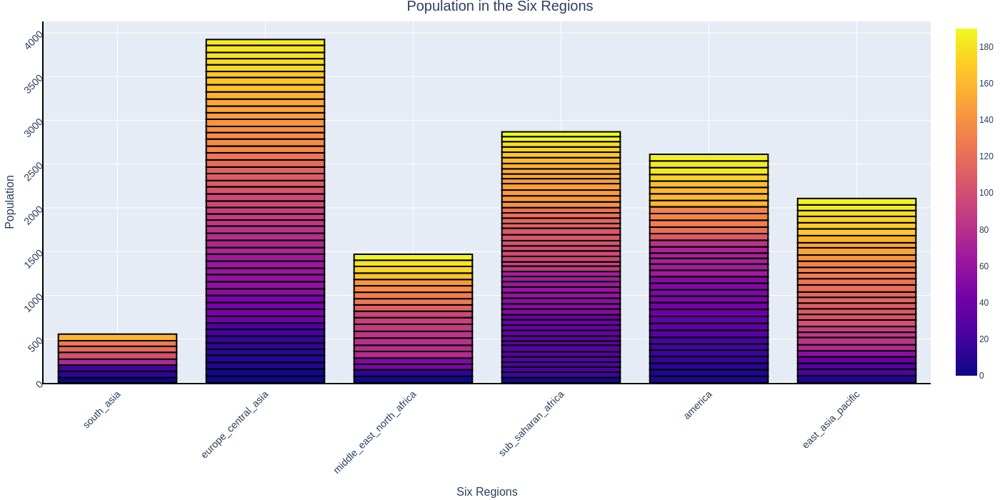

# Technologies and big data analysis tools
These are the practices from some AI-related course from my university. It was taught by 
our department of applied mathematics.

_# noinspection MachineTranslation_

_# noinspection Math_

---

## Practice 1 - Getting started with Python language

### Task 1
Install Python - _Seriously!_

### Task 2

Write a program that calculates the area of a figure,
the parameters of which are supplied to the input. Figures that are submitted for input:
triangle, rectangle, circle. The result of the work is a dictionary, where
the key is the name of the figure, and the value is the area.

P1T2

__Output__
```
t2 {'triangle': 1.0, 'rectangle': 12.0, 'circle':
78.53981633974483}
```

### Task 3

Write a program that takes two numbers as input and
the operation that needs to be applied to them. Must be implemented
the following operations: +, -, /, //, abs – modulus, pow or ** – exponentiation.

P1T3

__Output__
```
t3 3.0 2.0 1.0
```

### Task 4

Write a program that reads numbers from the console (by
one per line) until the sum of the entered numbers is equal to 0 and
after that it displays the sum of the squares of all read numbers.

P1T4

__Output__
```
t4:
1
2
-3
t4 14
```

### Task 5

Write a program that prints the sequence
numbers of length N, where each number is repeated as many times as it is equal to.
A non-negative integer N is passed to the program input. For example, if
N = 7, then the program should print 1 2 2 3 3 3 4. Printing list elements
separated by a space – print(*list).

P1T5

__Output__
```
t5 [1, 2, 2, 3, 3, 3, 4]
```

### Task 6

Given two lists: A = [1, 2, 3, 4, 2, 1, 3, 4, 5, 6, 5, 4, 3, 2] B =
['a', 'b', 'c', 'c', 'c', 'b', 'a', 'c', 'a', 'a', 'b', 'c', ' b', 'a']. Create a dictionary in
in which the keys are the contents of list B, and the values for the dictionary keys are
is the sum of all elements of list A according to the letter contained in
the same position in list B. Example program result: {‘a’ : 10, ‘b’ : 15, ‘c’
: 6}.

P1T6

__Output__
```
t6 {'a': 17, 'b': 11, 'c': 17}
```

### Task 7-12

Tasks seven to twelve were combined into
due to their small size. 7. Download and Upload Home Value Data
in California using the sklearn library. 8. Use the info() method. 9.
Find out if there are missing values using isna().sum(). 10. Withdraw
records where the average age of houses in the area is more than 50 years and the population is more than
2500 people using the loc() method. 11. Find out the maximum and minimum
median house price values. 12. Using the apply() method, output to
screen the name of the characteristic and its average value.

P1T7_12

__Output__
```
t7:
        MedInc  HouseAge  AveRooms  ...  AveOccup  Latitude  Longitude
0      8.3252      41.0  6.984127  ...  2.555556     37.88    -122.23
1      8.3014      21.0  6.238137  ...  2.109842     37.86    -122.22
2      7.2574      52.0  8.288136  ...  2.802260     37.85    -122.24
3      5.6431      52.0  5.817352  ...  2.547945     37.85    -122.25
4      3.8462      52.0  6.281853  ...  2.181467     37.85    -122.25
...       ...       ...       ...  ...       ...       ...        ...
20635  1.5603      25.0  5.045455  ...  2.560606     39.48    -121.09
20636  2.5568      18.0  6.114035  ...  3.122807     39.49    -121.21
20637  1.7000      17.0  5.205543  ...  2.325635     39.43    -121.22
20638  1.8672      18.0  5.329513  ...  2.123209     39.43    -121.32
20639  2.3886      16.0  5.254717  ...  2.616981     39.37    -121.24

[20640 rows x 8 columns]

t8:
<class 'pandas.core.frame.DataFrame'>
RangeIndex: 20640 entries, 0 to 20639
Data columns (total 8 columns):
 #   Column      Non-Null Count  Dtype
---  ------      --------------  -----
 0   MedInc      20640 non-null  float64
 1   HouseAge    20640 non-null  float64
 2   AveRooms    20640 non-null  float64
 3   AveBedrms   20640 non-null  float64
 4   Population  20640 non-null  float64
 5   AveOccup    20640 non-null  float64
 6   Latitude    20640 non-null  float64
 7   Longitude   20640 non-null  float64
dtypes: float64(8)
memory usage: 1.3 MB

t9:
MedInc        0
HouseAge      0
AveRooms      0
AveBedrms     0
Population    0
AveOccup      0
Latitude      0
Longitude     0
dtype: int64

t10:
       MedInc  HouseAge  AveRooms  ...    AveOccup  Latitude  Longitude
460    1.4012      52.0  3.105714  ...    9.534286     37.87    -122.26
4131   3.5349      52.0  4.646119  ...    5.910959     34.13    -118.20
4440   2.6806      52.0  4.806283  ...    4.007853     34.08    -118.21
5986   1.8750      52.0  4.500000  ...   21.333333     34.10    -117.71
7369   3.1901      52.0  4.730942  ...    4.182735     33.97    -118.21
8227   2.3305      52.0  3.488860  ...    3.955439     33.78    -118.20
13034  6.1359      52.0  8.275862  ...  230.172414     38.69    -121.15
15634  1.8295      52.0  2.628169  ...    4.164789     37.80    -122.41
15652  0.9000      52.0  2.237474  ...    2.237474     37.80    -122.41
15657  2.5166      52.0  2.839075  ...    1.621520     37.79    -122.41
15659  1.7240      52.0  2.278566  ...    1.780142     37.79    -122.41
15795  2.5755      52.0  3.402576  ...    2.108696     37.77    -122.42
15868  2.8135      52.0  4.584329  ...    3.966799     37.76    -122.41

[13 rows x 8 columns]

t11:
15.0001 0.4999

t12:
MedInc           3.870671
HouseAge        28.639486
AveRooms         5.429000
AveBedrms        1.096675
Population    1425.476744
AveOccup         3.070655
Latitude        35.631861
Longitude     -119.569704
dtype: float64
```

---

## Practice 2 - Familiarize yourself with various data visualization libraries

### Task 1

Find and download multidimensional data (with a large number of features - columns) 
using the pandas library. Describe the data found in the report.

### Task 2

Display information about the data using the .info(), .head() methods.
Check data for empty values. If present, remove row data or interpolate missing
values. If necessary, additionally pre-process the data for further work with it.

t1-t2

__Output__
```
t2:
<class 'pandas.core.frame.DataFrame'>
RangeIndex: 197 entries, 0 to 196
Data columns (total 9 columns):
 #   Column             Non-Null Count  Dtype
---  ------             --------------  -----
 0   income             195 non-null    float64
 1   life_exp           195 non-null    float64
 2   population         195 non-null    float64
 3   year               197 non-null    int64
 4   country            197 non-null    object
 5   four_regions       193 non-null    object
 6   six_regions        193 non-null    object
 7   eight_regions      193 non-null    object
 8   world_bank_region  193 non-null    object
dtypes: float64(3), int64(1), object(5)
memory usage: 14.0+ KB
t2:
     income  life_exp  ...       eight_regions           world_bank_region
0   1910.0      61.0  ...           asia_west                  South Asia
1  11100.0      78.1  ...         europe_east       Europe & Central Asia
2  11100.0      74.7  ...        africa_north  Middle East & North Africa
3  46900.0      81.9  ...         europe_west       Europe & Central Asia
4   7680.0      60.8  ...  africa_sub_saharan          Sub-Saharan Africa

[5 rows x 9 columns]
```

### Task 3

Plot a bar chart (.bar) using the graph_objs module from the Plotly library with the following parameters:
1. On the X-axis indicate the date or name, on the Y-axis indicate the quantitative indicator.
2. Make the column take on a color depending on the value of the indicator (marker=dict(color=attribute, coloraxis="coloraxis")).
3. Make sure that the borders of each column are highlighted with a black line with a thickness of 2.
4. Display the chart title, centered at the top, with text size 20.
5. Add labels for the X and Y axes with a text size of 16. For the x-axis, rotate the labels so that they are read at an angle of 315.
6. Make the text size of the axis labels equal to 14.
7. Place the graph across the entire width of the work area and set the height to 700 pixels.
8. Add a grid to the graph, make its color 'ivory' and thickness equal to 2. (You can do this when setting the axes using gridwidth=2, gridcolor='ivory').
9. Remove extra padding along the edges.

t3

__Output__


### Task 4

Create a pie chart (go.Pie) using the data and design style from the previous graph. 
Make sure that the boundaries of each share are highlighted with a black line with a 
thickness of 2 and the categories of the pie chart are readable (for example, combine 
some objects).

t4

__Output__


### Task 5

Construct linear graphs, take one of the parameters and determine the relationship 
between several other (from 2 to 5) indicators using the matplotlib library. Draw a 
conclusion. Make a graph with lines and markers, line color 'crimson', point color 
'white', point border color 'black', point border thickness 2. Add a grid to the 
graph, make its color 'mistyrose' and width equal to 2. (You can do this when 
setting the axes using linewidth=2, color='mistyrose').

t5

__Output__


__Conclusion__\
The first graph shows that the higher the income, the longer the life expectancy.
The second graph shows that the majority of income is concentrated in the vast 
minority of people, and also that most people have incomes that do not exceed $20,000.

### Task 6

Visualize multidimensional data using t-SNE. It is necessary to use the MNIST or 
fashion MNIST data set (you can also use other ready-made data sets where you can 
observe the division of objects into clusters). Consider the visualization results 
for different perplexity values.

t6

__Output__
```
t6:    label  1x1  1x2  1x3  1x4  1x5  ...  28x23  28x24  28x25  28x26  28x27  28x28
0      5    0    0    0    0    0  ...      0      0      0      0      0      0
1      0    0    0    0    0    0  ...      0      0      0      0      0      0
2      4    0    0    0    0    0  ...      0      0      0      0      0      0
3      1    0    0    0    0    0  ...      0      0      0      0      0      0
4      9    0    0    0    0    0  ...      0      0      0      0      0      0

[5 rows x 785 columns]
t6: Elapsed time: 1.5147051811218262 seconds
```


__Conclusion__\
From the resulting graphs it follows that the higher the perplexity value, the larger the 
clusters become. Perplexity (a variable parameter) describes the expected density around 
each point. Low values focus the algorithm on fewer neighbors, high values reduce the 
number of more densely packed groups.

### Task 7

Visualize multidimensional data using UMAP with different n_neighbors and min_dist 
parameters. Calculate the running time of the algorithm using the time library and 
compare it with the running time of t-SNE.

t7

__Output__
```
t7: Elapsed time: 1.9380676746368408 seconds
```


__Conclusion__\
Based on the obtained graphs, we can draw the following conclusion: Small values of 
the n_neighbors parameter mean that the algorithm is limited to a small neighborhood 
around each point - it tries to capture the local structure of the data. Large ones 
retain the global structure, but lose details. The min_dist parameter determines the 
minimum distance at which points can be located in the new space. Low values define 
the division of data into clusters, while high values define the structure of the data 
as a whole. Despite the fact that theoretically the UMAP method should be faster than 
the TSNE method, practical measurements have shown the opposite, although the difference 
is less than a second. The likely reason is that only the first 1000 data items are used, 
so both methods are fast, but if you increase the number of data items, the UMAP method 
is faster.


---

### Task *

# TODO

*

__Output__
```
TODO
```

---
